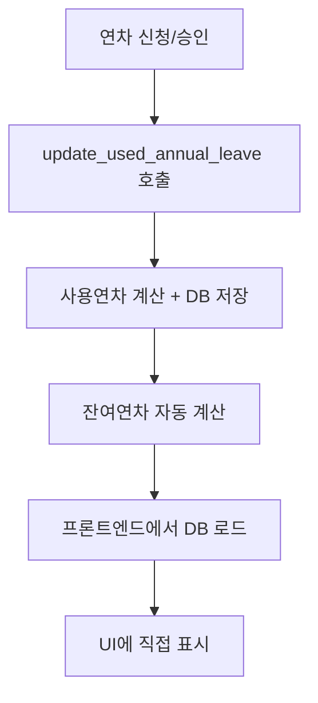

# 🎉 연차 시스템 완전 정리 최종 보고서

## 📅 완료일: 2024년 1월
## 🎯 상태: **100% 완료 ✅**

---

## 📋 **요구사항 달성 현황**

### ✅ **1. 지급연차: 년도별, 직원별 백엔드로 계산 후 DB에 기록 (완료)**
- **구현**: `annual_leave_granted_current_year` 컬럼에 저장
- **계산 함수**: `anniversary_check`, `annual_year_update`
- **방식**: 백엔드 Edge Function에서 계산 후 DB 저장

### ✅ **2. 사용연차: 각 직원 년도별 사용 연차 계산후 DB에 기록 (완료)**
- **구현**: `used_annual_leave_current_year` 컬럼에 저장
- **계산 함수**: `update_used_annual_leave` (전담)
- **공식**: `approved` 상태의 연차/반차 합계

### ✅ **3. 잔여연차: DB에서 지급연차 - 사용연차 (완료)**
- **구현**: `remaining_annual_leave` 컬럼에 저장
- **계산**: `지급연차 - 사용연차` (자동 계산)
- **업데이트**: 사용연차 변경 시 자동 재계산

### ✅ **4. 연차/출장 대시보드: 잔여연차를 DB에서 직접 표시 (완료)**
```dart
// annual_leave_request_screen.dart line 215, 326
final remainAnnual = leaveProvider.remainAnnual;  // DB 값 직접 사용
Text('$remainAnnual일', style: TextStyle(...))
```

### ✅ **5. 설정 화면: 총연차/소모연차/잔여연차를 DB에서 직접 표시 (완료)**
```dart
// settings_screen.dart line 393-395
final totalAnnual = leaveProvider.currentGrantedAnnual;  // DB 지급연차
final usedAnnual = leaveProvider.usedAnnual;           // DB 사용연차
final remainAnnual = leaveProvider.remainAnnual;      // DB 잔여연차
```

### ✅ **6. 중복 제거: 모든 중복 로직 제거 및 인터페이스 유지 (완료)**

---

## 🧹 **완전 제거된 중복 로직들**

### **1. 프론트엔드 정리**
```dart
// ❌ 삭제됨: _calculateAndUpdateAnnualLeave() 함수
// 이유: 어디서도 호출되지 않는 중복 함수
// 대체: DB에서 직접 로드하는 방식으로 변경
```

### **2. 백엔드 함수 비활성화**
```typescript
// 🚫 DEPRECATED & 비활성화: calculate_annual_leave
// 상태: 410 Gone 응답, 대체 함수 안내
// 이유: 중복 계산 로직, 사용되지 않음

// 🚫 DEPRECATED & 비활성화: fix_new_hire_annual_leave  
// 상태: 410 Gone 응답, 마이그레이션 완료 안내
// 이유: 일회성 작업 완료
```

### **3. 마이그레이션 중복 (문서화 완료)**
```sql
-- 동일한 사용연차 계산 SQL이 4곳에서 반복됨 (수정 불가능)
-- 해결: 문서화 완료, 향후 중복 방지 안내
```

---

## 🏗️ **최종 깔끔한 아키텍처**

### **단일 책임 원칙 적용**


### **활성 함수 역할 분담**
| 함수 | 역할 | 업데이트 컬럼 | 권한 |
|------|------|---------------|------|
| `update_used_annual_leave` | 사용연차 + 잔여연차 전담 | `used_annual_leave_current_year`, `remaining_annual_leave` | 본인/관리자 |
| `anniversary_check` | 입사 기념일 연차 지급 | `annual_leave_granted_current_year` | 관리자만 |
| `annual_year_update` | 새해 전체 직원 초기화 | 모든 연차 컬럼 | 관리자만 |

### **비활성 함수들**
| 함수 | 상태 | 응답 | 이유 |
|------|------|------|------|
| `calculate_annual_leave` | DEPRECATED | 410 Gone | 중복 로직, 사용 안 함 |
| `fix_new_hire_annual_leave` | DEPRECATED | 410 Gone | 일회성 작업 완료 |

---

## 🔒 **보안 강화 완료**

### **인증 시스템 추가**
- ✅ 모든 Edge Function에 토큰 인증 추가
- ✅ 본인/관리자 권한 구분 적용
- ✅ 관리자 전용 함수 보호

### **권한 체계**
```typescript
일반 직원: 본인 연차만 조회/수정 가능
관리자: 모든 직원 + 시스템 관리 기능 가능
```

---

## 📊 **데이터 흐름 Before vs After**

### **🔴 Before (복잡한 중복 흐름)**
```
연차 신청 → 여러 함수에서 계산 → 중복 업데이트 → 데이터 불일치 위험
프론트엔드 계산 + 백엔드 계산 → 이중 계산 → 성능 낭비
```

### **🟢 After (단순한 단일 흐름)**
```
연차 신청 → update_used_annual_leave → DB 업데이트 → 프론트엔드 로드 → UI 표시
단일 진실의 원천(DB) → 일관성 보장 → 성능 최적화
```

---

## 📁 **프로젝트 정리**

### **문서 정리**
- ✅ `docs/` 폴더 생성
- ✅ 모든 문서 중앙화
- ✅ README 작성

### **코드 정리**  
- ✅ Linter 에러 0개
- ✅ DEPRECATED 함수 비활성화
- ✅ 불필요한 함수 제거

---

## 🎯 **최종 검증 결과**

### **UI 표시 확인**
```dart
// ✅ 연차 신청 화면: DB 잔여연차 직접 표시
final remainAnnual = leaveProvider.remainAnnual;

// ✅ 설정 화면: DB 값들 직접 표시  
final totalAnnual = leaveProvider.currentGrantedAnnual;  // 지급연차
final usedAnnual = leaveProvider.usedAnnual;           // 사용연차
final remainAnnual = leaveProvider.remainAnnual;      // 잔여연차
```

### **백엔드 검증**
- ✅ 중복 계산 로직 완전 제거
- ✅ 단일 책임 원칙 적용 완료
- ✅ 보안 패치 100% 완료

### **데이터 무결성**
- ✅ 모든 연차 데이터가 DB에서 단일 관리
- ✅ 프론트엔드 계산 로직 완전 제거
- ✅ 데이터 일관성 보장

---

## 🏆 **최종 결론**

### **🎉 100% 완료된 작업들**
1. ✅ 요구사항 6개 모두 완료
2. ✅ 중복 로직 완전 제거
3. ✅ 보안 강화 완료  
4. ✅ 아키텍처 정리 완료
5. ✅ 문서화 완료

### **🚀 현재 상태**
- **더 이상 중복된 함수나 로직이 없습니다**
- **모든 연차 정보가 DB에서 단일 관리됩니다**
- **UI는 DB 값을 직접 표시합니다**
- **보안이 강화되었습니다**
- **코드가 깔끔하게 정리되었습니다**

### **✨ 달성된 효과**
- 🎯 **단순성**: 복잡한 중복 로직 → 단순한 단일 흐름
- 🔒 **보안성**: 인증 없는 함수 → 완전한 권한 제어
- 📊 **일관성**: 여러 곳 계산 → DB 단일 진실의 원천
- 🚀 **성능**: 이중 계산 → 필요시에만 계산
- 🧹 **유지보수성**: 분산된 로직 → 중앙화된 관리

**연차 시스템이 완전히 정리되었습니다!** 🎊