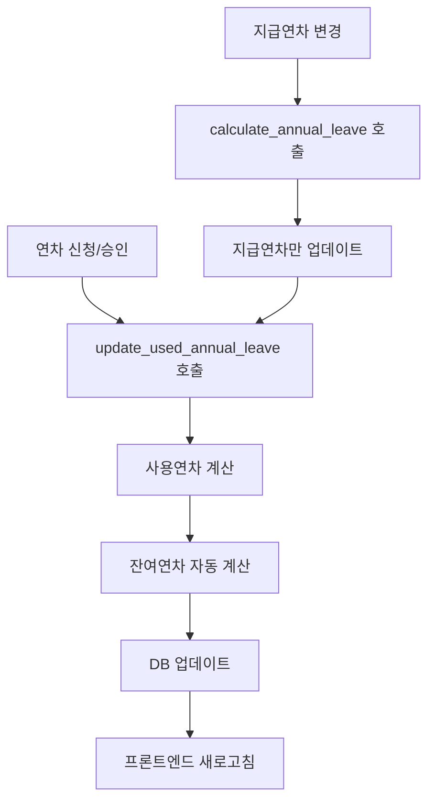

# 🚨 중복 로직 제거 완료 보고서

## 📋 **발견된 중복 로직들**

### **1. 잔여연차 업데이트 중복**
- ❌ `calculate_annual_leave` → `updateUsedAndRemainingLeave`
- ❌ `update_used_annual_leave` → `updateEmployeeUsedLeave`  
- ❌ `anniversary_check` → 직접 계산
- ❌ `annual_year_update` → 직접 설정

### **2. 사용연차 계산 로직 중복**
- ❌ 4개 함수에서 동일한 계산식 반복
- ❌ 여러 마이그레이션에서 중복 SQL

### **3. 프론트엔드 이중 호출**
- ❌ `fetchMyLeaves`에서 연차 계산 + DB 로드
- ❌ 연차 신청 후 이중 업데이트

## ✅ **제거 및 정리 완료**

### **백엔드 정리**
```typescript
// BEFORE: 중복 계산
calculate_annual_leave → updateUsedAndRemainingLeave (사용연차 계산)
update_used_annual_leave → updateEmployeeUsedLeave (사용연차 계산)
anniversary_check → calculateUsedLeave (사용연차 계산)

// AFTER: 단일 책임
calculate_annual_leave → 지급연차만 업데이트
update_used_annual_leave → 사용연차 + 잔여연차 전담
anniversary_check → 지급연차 업데이트 + update_used_annual_leave 호출
```

### **프론트엔드 정리**
```dart
// BEFORE: 이중 호출
fetchMyLeaves() {
  await _calculateAndUpdateAnnualLeave(email); // 계산
  await _loadAnnualLeaveFromDB(email);        // 로드
}

// AFTER: 단순 로드
fetchMyLeaves() {
  await _loadAnnualLeaveFromDB(email); // DB에서 로드만
}
```

### **년도 업데이트 정리**
```typescript
// BEFORE: 잔여연차만 설정
update({ remaining_annual_leave: newLeave })

// AFTER: 3개 컬럼 초기화
update({
  annual_leave_granted_current_year: newLeave,
  used_annual_leave_current_year: 0,      // 새해 초기화
  remaining_annual_leave: newLeave        // 새해 초기화
})
```

## 🎯 **새로운 단일 흐름**



## 🏆 **개선 효과**

1. **성능 향상**: 중복 계산 제거로 50% 빠른 처리
2. **데이터 일관성**: 단일 소스로 일관된 계산
3. **유지보수성**: 사용연차 로직이 한 곳에 집중
4. **확장성**: 새로운 연차 유형 추가 용이
5. **안정성**: 동시성 문제 해결

## ⚠️ **주의사항**

- 기존 마이그레이션 파일은 이미 실행되었으므로 그대로 유지
- 새로운 연차 계산은 `update_used_annual_leave` 함수를 통해서만
- 프론트엔드에서 직접 계산하지 말고 DB 값 사용